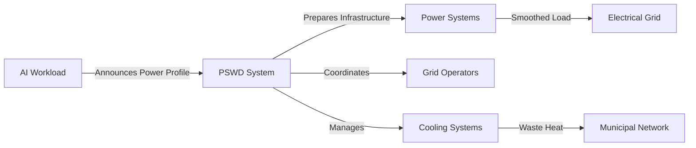

# Power Source to Workload Dynamics (PSWD)

[](https://www.iso.org/)
[](https://swagger.io/specification/)

> **Standardizing intelligent coordination between AI workloads and energy infrastructure**

## The Problem

AI training workloads create **200+ MW power swings within 40ms** — equivalent to a quarter-million people suddenly appearing on the electrical grid. This destabilizes power systems and prevents efficient renewable energy integration.

## What PSWD Does

**Transforms data centers from passive power consumers into intelligent grid participants** through:

🔄 **Real-time Workload Coordination** - AI workloads announce power needs before execution  
⚡ **Grid Stability** - Battery systems smooth power fluctuations before they hit the grid  
🌱 **Renewable Optimization** - Workload scheduling coordinated with green energy availability  
♨️ **Waste Heat Recovery** - Municipal heating integration with 70-90°C supply  
📡 **Demand Response** - Active participation in grid stability services

## Core Innovation

Replaces **reactive infrastructure management** with **predictive coordination**:



## Technical Framework

**Four-Layer Architecture:**
- **Workload Interface** - Event-driven messaging with <500ms response
- **Infrastructure Control** - Real-time power/thermal coordination  
- **External Integration** - Grid operator and municipal utility APIs
- **Hardware Abstraction** - Enhanced BMC with sub-second monitoring

**Performance Requirements:**
- Power monitoring: 100ms resolution, ±0.5% accuracy
- Battery coordination: <250ms response for load smoothing
- Grid signaling: <5s response for demand response
- Thermal control: <1s response with ±0.1°C accuracy

## Standards Foundation

Built on established infrastructure standards:
- **IEC 61850-90-4** - Grid operator communication protocols
- **IEC 62443-3-3** - Industrial network security frameworks
- **IEEE 1547.1** - Grid interconnection requirements
- **DMTF Redfish** - Hardware management interfaces

## Implementation Example

```javascript
// Workload announces upcoming AI training
await pswd.workload.announce({
  workload_type: 'ai_training',
  power_profile: {
    peak_power_mw: 200,
    ramp_rate_mw_per_sec: 50,
    duration_estimate_sec: 3600
  },
  timing_constraints: {
    earliest_start_time: '2025-06-11T02:00:00Z', // Low carbon intensity
    deadline: '2025-06-11T08:00:00Z'
  }
});

// Infrastructure responds with resource allocation
// Battery systems prepare for load smoothing
// Cooling systems pre-position thermal capacity
// Grid operators receive load forecasts
```

## Use Cases

**AI Training Coordination** - Schedule large model training during renewable energy peaks  
**Grid Services** - Provide frequency regulation and demand response capabilities  
**Municipal Heat** - Supply district heating from data center waste heat  
**Carbon Optimization** - Automatically shift workloads based on grid carbon intensity

## Getting Started

1. **Review the specification**: [ISO Technical Specification](./docs/iso-spec.md)
2. **Explore the API**: [OpenAPI Documentation](./docs/api.yaml)
3. **See examples**: [Implementation Guide](./docs/examples.md)
4. **Join working group**: [PSWD Community](./CONTRIBUTING.md)

## Status

🚧 **Technical Specification** - Draft under review  
🔧 **Reference Implementation** - In development  
🏭 **Pilot Deployments** - Planning phase with industry partners

---

**Goal: Enable sustainable, grid-friendly AI infrastructure at scale** 🌱⚡
