# Workload Dynamic Power and Cooling (WDPC)

[](https://opensource.org/licenses/MIT)

> **Standardized data coordination between computational workloads and energy infrastructure**

## Problem

AI workloads create **200+ MW power swings within 40ms**, destabilizing electrical grids. Current data centers lack consistent data movement mechanisms for coordinated workload-infrastructure optimization.

## Solution

WDPC provides standardized temporal data formats and interfaces enabling intelligent coordination without prescriptive control implementation.

**Key Capabilities:**
- 🕐 **Temporal Data Standards** - 100ms resolution with metadata tagging
- 🔌 **Infrastructure Coordination** - Power, thermal, and grid data integration  
- 🌱 **Renewable Optimization** - Carbon-aware workload scheduling data
- ♨️ **Heat Recovery** - Municipal heating network coordination

## Quick Example

```javascript
// Workload announces power characteristics
await wdpc.workload.announce({
  workload_type: 'ai_training',
  power_profile: {
    peak_power_mw: 150,
    baseline_power_mw: 50,
    temporal_resolution_ms: 100
  },
  metadata_tags: {
    environmental_preferences: ['low_carbon', 'renewable_energy']
  }
});

// Infrastructure responds with capability data
const response = await wdpc.infrastructure.getCapabilities();
```

## Architecture

```mermaid
graph TD
    A[🧠 AI/HPC Workloads] --> B[💻 Workload Data Interface]
    B --> C[🏗️ Infrastructure Data Coordination]
    C --> D[🔧 Hardware Instrumentation]
    C --> E[🔗 External Data Integration]
    E --> F[🌐 Grid Operators]
    E --> G[🏘️ Municipal Systems]
```



## Technical Specs

| Component | Requirement |
|-----------|-------------|
| Temporal Resolution | 100ms minimum |
| Power Accuracy | ±0.5% |
| Temperature Accuracy | ±0.1°C |
| Time Synchronization | ±1ms (NTP/PTP) |
| Data Format | JSON with metadata |

## Standards Compliance

- **IEC 61850-90-4** - Grid communication
- **IEC 62443-3-3** - Industrial security
- **IEEE 1547.1** - Grid interconnection
- **DMTF Redfish** - Hardware management

## Installation

```bash
npm install @wdpc/data-client
```

```bash
docker run -d --name wdpc-server wdpc/server:latest
```

## Use Cases

- **AI Training Coordination** - Schedule compute during renewable energy peaks
- **Grid Stability** - Provide load forecasting and demand response data
- **Municipal Heat** - Coordinate waste heat delivery to district heating
- **Carbon Optimization** - Enable workload scheduling based on grid carbon intensity

## Development

```bash
git clone https://github.com/wdpc/wdpc-spec.git
cd wdpc-spec
npm install && npm test
```

## Contributing

We welcome contributions! See [CONTRIBUTING.md](CONTRIBUTING.md) for guidelines.

## License

MIT License - see [LICENSE](LICENSE) file for details.

---

**Creating the data foundation for sustainable, grid-friendly infrastructure** 🌱⚡
