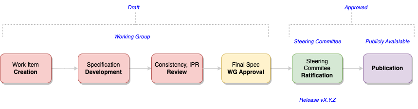
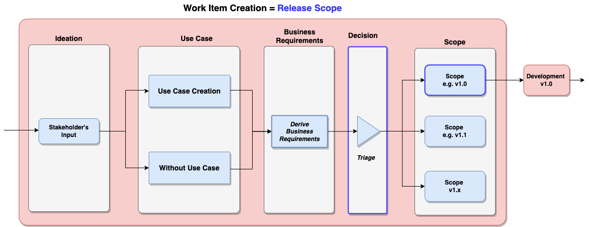
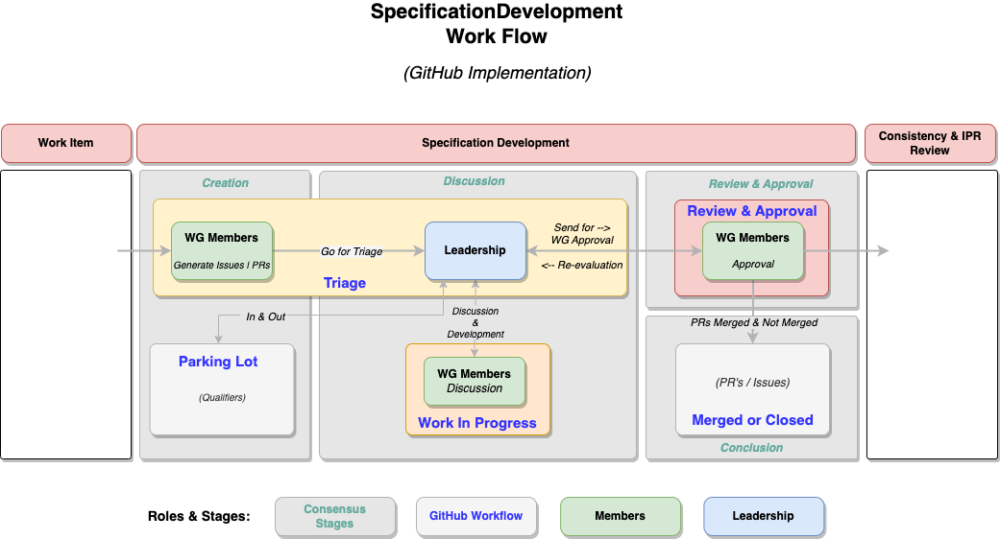
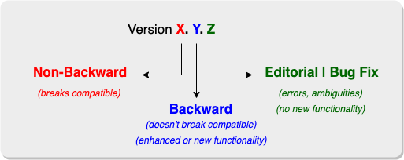

# Technical Specification Development on GitHub
## Introduction
This document is a comprehensive guide for creating Technical Specifications using GitHub. It covers essential principles employed by Standards Development Organizations (SDOs), providing readers with a clear understanding of the standards framework, workflows, and processes as implemented in GitHub's environment.

## Get Started

<figure>
	
	<figcaption>Specification Lifecycle</figcaption>
</figure>

## Technical Specifications Lifecycle
[add details]

## Standards Specifications Lifecycle
The diagram illustrates the lifecycle of creating a technical specification, detailing the stages from initial creation to publication. The process is divided into several key phases, each involving specific tasks and approvals:

## Work Item Creation: 

This initial phase is where a new work item is proposed and created. This phase involves identifying the need for a new specification and defining the scope and objectives.

- **Specification Development:** The working group develops the specification in this phase. This involves drafting the technical content, incorporating requirements, and iterating on the details to ensure the specification meets the intended goals.
```
Note: See further detail about development efforts & milestones
```
- **Consistency, IPR Review:** Once the draft specification is developed, it undergoes a review for consistency and intellectual property rights (IPR) compliance. This ensures that the specification is coherent, does not infringe on existing intellectual properties, and aligns with relevant standards and guidelines.

- **Final Specification Working Group Approval:** After the consistency and IPR review, the final specification is submitted for approval by the working group. This step is crucial for validating that the specification meets all technical and quality standards the working group sets.

- **Steering Committee Ratification:** Upon working group approval, the specification moves to the steering committee for ratification. This committee provides a higher level of oversight and ensures the specification is ready for public release.

- **Technical Specification Publication:** Once ratified by the steering committee, the specification is published and publicly available. This marks the official release of the specification, identified by a version number (e.g., Release vX.Y.Z), and it can be accessed and implemented by relevant stakeholders.

Each phase in this lifecycle is interconnected and requires thorough review and approval processes to ensure the technical specification is robust, compliant, and ready for implementation. The transition from one phase to the next signifies progress from initial concept to final public release, involving various stakeholders and committees to maintain quality and integrity throughout the process.

### Work Item Creation

<figure>
	
	<figcaption>Work Item Creation</figcaption>
</figure>

The diagram outlines the detailed steps involved in the first phase of the specifications lifecycle, namely Work Item Creation. This phase focuses on defining the scope of the release and involves the following steps:

- **Ideation**
  - Stakeholder Input: The process begins with input from various stakeholders. This input can include ideas, requirements, or problems that need to be addressed by the new specification. Stakeholders can be anyone from industry experts, users, developers, or other relevant parties.

- **Use Case**
  - Use Case Creation: Based on the stakeholder's input, specific use cases are created. These use cases describe scenarios in which the specification will be applied, highlighting the needs and requirements from a practical perspective.
  - Without Use Case: In some situations, there might not be a clearly defined use case. Even without specific use cases, the process can continue, focusing on the broader requirements or goals outlined by the stakeholders.

- **Business Requirements**
  - Derive Business Requirements: Whether starting with or without use cases, the next step is to derive business requirements. This involves translating the practical use cases or stakeholder inputs into formal business requirements. These requirements specify what the business needs are, ensuring the technical specification aligns with organizational goals and user needs.

- **Decision**
  - Triage: The derived business requirements are then subjected to a triage process. During triage, the requirements are reviewed, prioritized, and possibly filtered. This step ensures that only the most critical and feasible requirements are selected for inclusion in the scope of the release. It also helps in managing resources effectively and aligning the project with strategic objectives.

- **Scope**
  - Scope (e.g., v1.0, v1.1, v1.x): The final step in this phase is defining the scope of the release. Based on the prioritized business requirements, the specific scope for different versions of the specification is determined. For instance:
    - Scope v1.0: This might include the initial core features and requirements that are essential for the first version.
    - Scope v1.1: Subsequent minor versions can include additional features or refinements that build upon the initial release.
    - Scope v1.x: This can represent further iterations, each adding more functionalities or improvements.

**Development** Once the scope is defined, the process moves into the development phase for version 1.0, where the actual creation and detailing of the specification begin based on the outlined scope.

Each of these steps is crucial in ensuring that the work item creation phase effectively captures and prioritizes stakeholder needs, translates them into actionable business requirements, and defines a clear, manageable scope for the development of the specification.

### Development
These are the stages to develop Technical Specifications:

- Creation:
- Discussion:
- Review & Approval:
- Conclusion:

<figure>
	
	<figcaption>Spec Development</figcaption>
</figure>

### Technical Specification Development

Technical Specification Development
The diagram provided outlines the second phase of the technical specification lifecycle, which is Specification Development. This phase focuses on creating, discussing, reviewing, and approving changes to the specification, leading to a final consensus. The process involves several key steps and roles, mapped onto GitHub Projects' Kanban view stages to facilitate workflow management and stakeholder consensus.

### Steps and Roles in Specification Development

#### Creation

**WG Members Generate Issues/PRs**: Working Group (WG) members initiate the process by generating issues or pull requests (PRs) based on the scope defined in the previous phase. These issues or PRs represent proposed changes, new features, or necessary corrections.

**Parking Lot (Qualifiers):** Items that are not immediately actionable or require further clarification are placed in the Parking Lot. This stage allows for qualification and prioritization before proceeding to the next step.

#### Discussion
**Triage: **Issues and PRs from the creation stage are reviewed and prioritized during triage. This involves assessing the relevance, urgency, and alignment with project goals. Leadership (chairs, editors, and maintainers) oversees this step to ensure strategic alignment.

**Work in Progress (WG Members Discussion):** Once triaged, the issues and PRs are moved to Work in Progress. Here, WG members engage in detailed discussions and development activities. This collaborative effort includes drafting, revising, and refining the specification content.

**Leadership (Discussion & Development):** Leadership plays a crucial role in facilitating discussions, providing guidance, and resolving conflicts. They ensure that the development process adheres to project standards and timelines.

#### Review & Approval
**WG Members Review & Approval:** After the development work, the proposed changes undergo a review by WG members. This stage involves thorough scrutiny to ensure technical accuracy, completeness, and consistency with the overall specification.

**Leadership (Send for WG Approval or Re-evaluation):** Leadership reviews the feedback and, if necessary, sends the item back for re-evaluation. Once the item meets all criteria, it is approved by the WG members.

#### Conclusion
**Merged or Closed (PRs/Issues):** Approved items are merged into the main branch or closed if deemed not necessary. This final step marks the conclusion of the development process for that specific item.

#### Mapping to GitHub Projects Kanban View
The above steps can be effectively managed using GitHub Projects' Kanban view, which helps visualize and track the progress of each item through different stages:

- **Triage** - Issues and PRs generated by WG members are first moved to the Triage column, where they are reviewed and prioritized.
- **Parking Lot** - Items that need further clarification or are not immediately actionable are placed in the Parking Lot column.
- **Work in Progress** - Items that have passed triage and are actively being developed and discussed are moved to the Work in Progress column. This stage includes collaborative development and refinement by WG members.
- **Review & Approval** - Completed items are moved to the Review & Approval column for thorough examination and approval by WG members.

Note: See Review & Approval diagram.

- **Closed** - Approved items are finally moved to the Closed column, indicating that they have been merged into the main branch or concluded.

#### Roles and Consensus Building

- **Members:** WG members are responsible for generating issues/PRs, engaging in discussions, and reviewing proposed changes. They ensure that the specification development is collaborative and meets the required standards.
- **Leadership** - Leadership (Chairs, Editors, Maintainers): Leadership oversees the entire development process, from triage to final approval. They facilitate discussions, resolve conflicts, and ensure the specification aligns with strategic goals and timelines.

By following this structured workflow and leveraging GitHub Projects' Kanban view, the specification development process becomes transparent, efficient, and collaborative, ultimately leading to stakeholder consensus and high-quality technical specifications.

### Formal Reviews
#### Consistency Review
#### IPR Review
#### Working Group Approval
#### Steering Committee Ratification
#### Publication

### Other Considerations
#### GitHub Flow
Single Trunk Branch
GitHub Flow - Single Trunk Branch

GitHub Flow - Single Trunk Branch
Note: See further details at: Single Trunk Branch - Detail Process. See Multi-Branch option as alternative.

### Branch Structure and Workflow
- **Main Branch (main or development):** The primary branch, often called main or development, serves as the central integration point for all feature branches. This branch accumulates all changes and updates from various development efforts.
- **Feature Branches:**
  - **Creation:** Feature branches are created from the main branch to develop new features or topics. These branches allow teams to work on specific aspects of the specification independently.
  - **Development:** Each feature branch undergoes multiple commits, representing iterative progress and development efforts on the specific feature or topic.
  - **Merging:** Once the development on a feature branch is complete and thoroughly tested, it is merged back into the main branch. This merge integrates the new feature into the overall development.
- **Bugfix Branches:**
  - Similar to feature branches, bugfix branches are created to address specific issues or errors in the specifications.
  - After fixing the bug, these changes are merged back into the main branch to update the specification with the corrections.
- **Cherry-Picking Commits:**
  - At certain points, specific commits from the main branch or other branches may be selectively cherry-picked to be included in a different branch. This allows for the integration of particular changes without merging the entire branch.

### Ratified Specifications Branch
In some workflows, it is beneficial to differentiate between the ongoing development work and the officially ratified specifications:

- **Development Branch (development): **This branch development (often the main branch in the initial setup) is where all feature and bugfix branches are merged. It serves as the working version of the specification, where new developments and updates are integrated. This requires to create a new branch called development and set it up as a default branch..
**Main (main):**
  - This branch main is specifically used to store the ratified versions of the specifications. It represents the finalized, approved versions that have been vetted and ratified by the steering committee or governing board.
  - Once the content in the development branch reaches a stable and approved state, it is merged into this main ratified branch. This process ensures that the main branch contains only the official, governing board-approved specifications.

### Release Management

#### Release Tagging:

- Labels that point to specific commits in the development timeline marked as releases. These are significant milestones where the specification is deemed stable and ready for wider use or further ratification:
- **Release/Name X:** Represents a specific version or milestone of the specification.
- **Release/Name Y:** Represents another version or milestone, incorporating further developments, features, or bug fixes.

## Summary

This GitHub flow ensures a structured approach to developing and managing technical specifications. By using feature branches for new developments and bugfix branches for corrections, teams can work independently and integrate changes in an organized manner. Differentiating between a development branch and a ratified specifications branch ensures clarity and stability, with the main ratified branch representing the official, approved state of the specifications. This flow facilitates collaborative development, thorough testing, and structured ratification of technical specifications.

### GitHub Labels
#### Semantic Versioning

<figure>
	
	<figcaption>Semantic Versioning</figcaption>
</figure>

#### Semantic Versioning Rules
The diagram illustrates the principles of semantic versioning, a versioning scheme for technical specifications that conveys meaning about the underlying changes with each new release. Semantic versioning uses a three-part version number: X.Y.Z.
```
The Technical Specification evolves from e.g., Candidate Release v1.0 to formal Release v1.0 after the Ratification by the Steering Committee or Gorverning Board.
```

- **X (Major Version):** Changes here denote non-backward compatible updates, meaning they introduce changes that are not compatible with previous versions. These changes could include major alterations in the specification's structure, requirements, or guidelines that break compatibility with previous versions.
- **Y (Minor Version):** Changes here are backward compatible and often introduce new features, enhancements or clarifications witout breaking the existing specifications. These updates ensure that the existing implementations continues to work seamlessly with the new additions.
- **Z (Patch or Editorial Version):** Changes here involve backward-compatible editorial or bug fixes. These fixes address errors, ambiguities, or any minor issues without introducing any new functionality or altering existing guidelines.

#### Semantic Versioning Example Progression
- **Version 1.0 (first release):**
  - The initial release of a Technical Specification. This version sets the foundation with all the basic requirements and guidelines defined.
- **Version 1.0.1 (Bug/Editorial Fix):**
  - Criteria: This update addresses a bug discovered in the initial release. For example, if there was an error or ambiguity in the specification text, version 1.0.1 would correct this error without changing any of the existing guidelines.
```
Example: Fixing a typo, correcting an incorrect reference, or clarifying an ambiguous requirement in the specification.
```

- **Version 1.1 (Backward Compatible Enhancements):** - Criteria: This update introduces new guidelines or enhancements that are backward compatible. For instance, adding a new section to the specification that provides additional guidance or optional best practices that do not alter the existing requirements.
```
Example: Suppose the initial release specified basic compliance requirements. Version 1.1 could introduce new optional recommendations for improved compliance while ensuring that the previous requirements remain valid and unchanged.
```

- **Version 2.0 (Non-Backward Compatible Changes): Criteria:** This update makes changes that are not backward compatible, meaning users will need to modify their existing implementations to comply with the new version. This might involve significant alterations or removals of existing guidelines.
```
Example: Suppose the initial release had a particular set of compliance criteria. Version 2.0 could replace these criteria with a more stringent or completely different set, requiring users to update their processes and documentation to meet the new standards. Alternatively, a requirement's parameters might be changed in a way that necessitates updates from the users.
```

### Summary
Semantic versioning helps users understand the scope and impact of changes with each new release of a technical specification. Bug fixes increment the patch number (Z), new backward-compatible guidelines or enhancements increment the minor version number (Y), and non-backward-compatible changes increment the major version number (X). This scheme ensures clear communication of changes and helps in maintaining consistency and clarity in the development and implementation of technical specifications.
